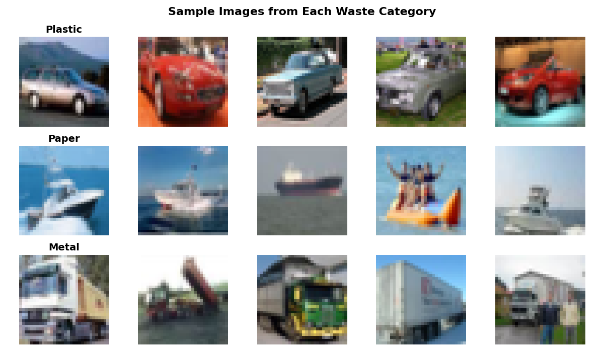
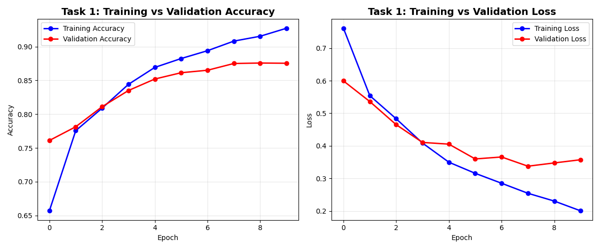
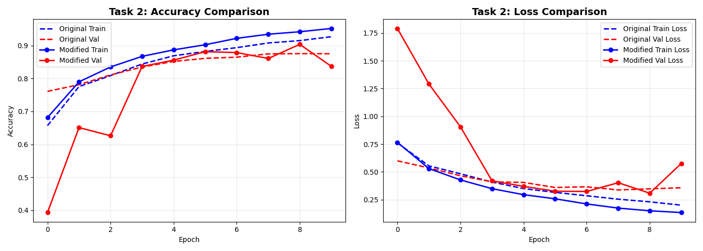
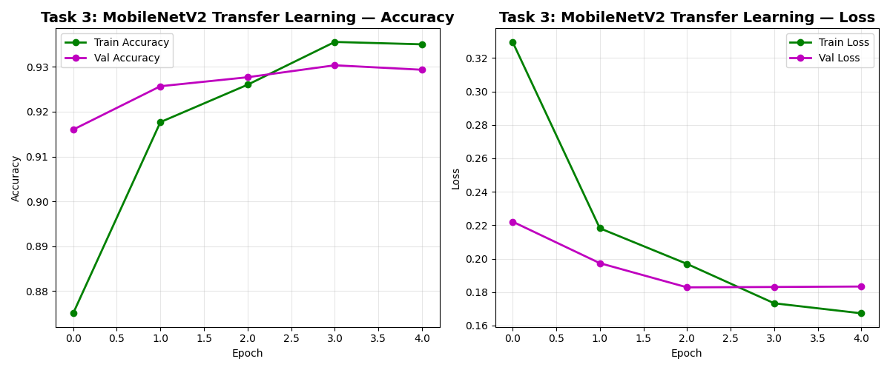
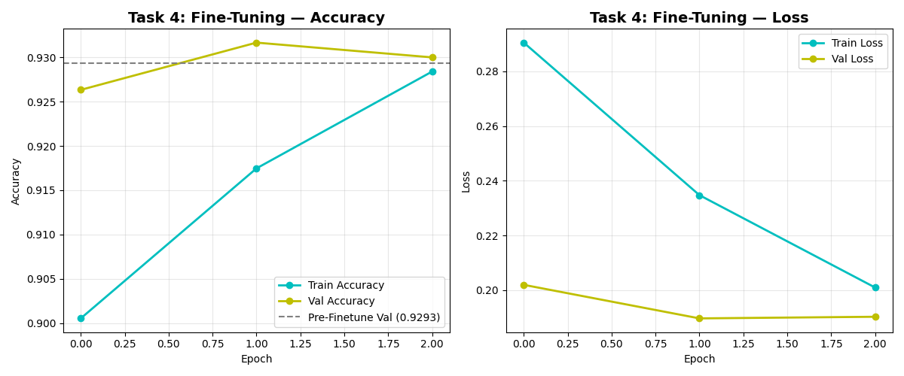

# Waste Classification CNN

## Overview
This project contains the implementation and analysis for **Waste Classification CNN**. 

## Contents
- **Jupyter Notebooks / Python Scripts:** Contains the source code, exploratory data analysis (EDA), and model building steps.
- **Datasets:** The data used for training and evaluating the models.
- **Outputs / Visualizations:** Charts and metrics evaluating model performance.

## How to Run
1. Ensure you have the required dependencies installed (see the main repository `requirements.txt`).
2. Run the `Waste_Classification_CNN.py` script in your preferred IDE or command line.
3. The code is self-documented with comments explaining each step of the pipeline.

## Results & Performance

Below are the evaluation metrics comparing our baseline CNN with the modified architecture and the MobileNetV2 transfer-learning models.

| Model Version               | Training Accuracy | Validation Accuracy |
|-----------------------------|-------------------|---------------------|
| **1. Original CNN**         | 92.72%            | 87.53%              |
| **2. Modified CNN**         | 95.23%            | 83.70%              |
| **3. MobileNetV2 (Frozen)** | 93.50%            | 92.93%              |
| **4. MobileNetV2 (Fine-Tuned)** | 92.84%        | **93.00%**          |

### Visualizations

#### Sample Images

#### Baseline CNN Training

#### Modified CNN Comparison

#### MobileNetV2 Transfer Learning

---
*This project is part of my professional AI Engineering portfolio.*
