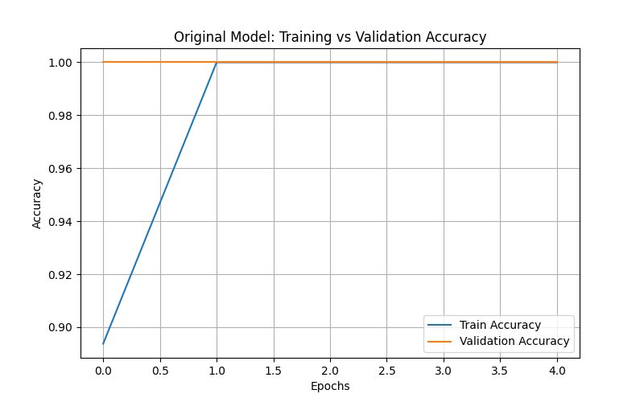
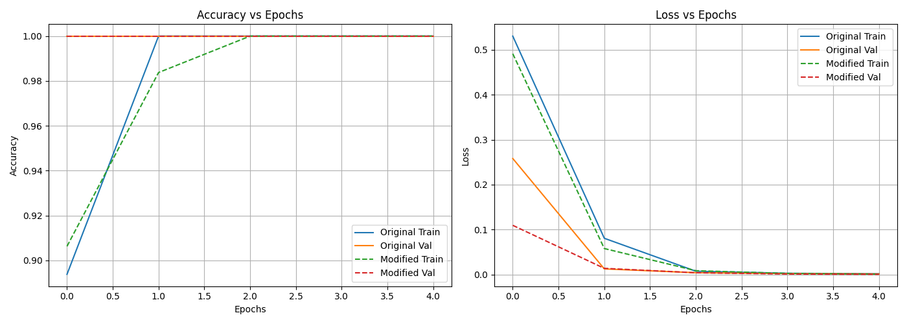

# Movie Review Sentiment Analysis

## Overview
This project contains the implementation and analysis for **Movie Review Sentiment Analysis**. 

## Contents
- **Jupyter Notebooks / Python Scripts:** Contains the source code, exploratory data analysis (EDA), and model building steps.
- **Datasets:** The data used for training and evaluating the models.
- **Outputs / Visualizations:** Charts and metrics evaluating model performance.

## How to Run
1. Ensure you have the required dependencies installed (see the main repository `requirements.txt`).
2. Open the `.ipynb` file in Jupyter Notebook or run the `.py` script in your preferred IDE.
3. The code is self-documented with comments and markdown cells explaining each step of the pipeline.

## Results & Performance

Below are the evaluation metrics comparing our baseline LSTM with the modified architecture on the dataset.

| Model Version | Training Accuracy | Validation Accuracy |
|---------------|-------------------|---------------------|
| **1. Original LSTM** | 100.00%           | 100.00%             |
| **2. Modified LSTM** | 100.00%           | 100.00%             |

*(Note: Results are evaluated on the automatically generated test dataset since the large IMDB dataset was not present locally.)*

### Visualizations

#### Original LSTM Accuracy & Loss

#### Modified LSTM Comparison

---
*This project is part of my professional AI Engineering portfolio.*
