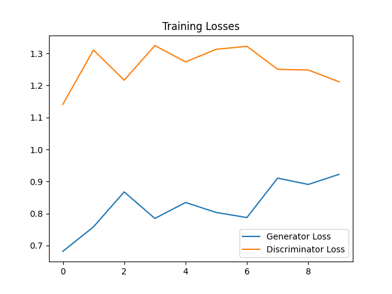
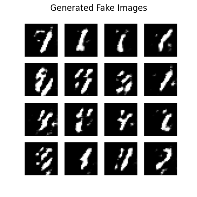
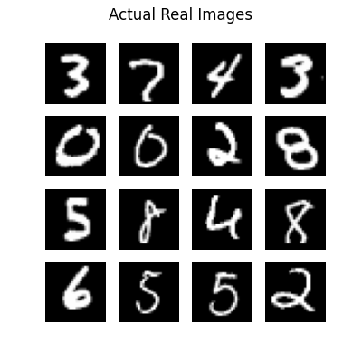

# Deep Convolutional Generative Adversarial Network (DCGAN)

## 📌 Overview
This project implements a Deep Convolutional Generative Adversarial Network (DCGAN) from scratch using TensorFlow and Keras. The primary objective is to train a model to learn the underlying data distribution of the MNIST dataset and generate highly realistic, synthetic handwritten digits.

## 🏗️ Model Architecture
The project utilizes an adversarial training process, pitting two separate neural networks against each other in a zero-sum game:

- **The Generator:** Takes a random noise vector (latent space of 100 dimensions) and utilizes `Conv2DTranspose` layers (coupled with Batch Normalization and LeakyReLU activations) to progressively upscale the noise into a 28x28 grayscale image.
- **The Discriminator:** A traditional Convolutional Neural Network (CNN) that acts as a binary classifier. It uses `Conv2D` layers (with Dropout and LeakyReLU) to determine whether an inputted image is *real* (from the actual dataset) or *fake* (created by the Generator).

## 🚀 Training Pipeline
- **Dataset:** MNIST Handwritten Digits (60,000 training images, normalized to `[-1, 1]`)
- **Loss Function:** Binary Cross-Entropy (Minimax loss)
- **Optimizers:** Adam (`learning_rate=1e-4`)
- **Epochs:** 10

During training, the Generator constantly improves its ability to create realistic digits to "fool" the Discriminator, while the Discriminator simultaneously improves its ability to detect forgeries.

## 📊 Results & Visualizations

### Adversarial Loss Progression
The graph below demonstrates the adversarial game between the two networks over 10 epochs. As the Discriminator's loss fluctuates, the Generator adapts its weights to produce more convincing outputs.

### Generation Quality Comparison
After training, the Generator successfully learned the spatial hierarchies of handwritten digits. Below is a side-by-side visual comparison of the synthetic data generated entirely from random noise versus the actual ground-truth dataset.

| Generated Fake Images | Actual Real Images |
| :---: | :---: |
|  |  |

## 💻 How to Run
1. Ensure you have the required dependencies installed from the main repository `requirements.txt`.
2. Run the `GAN_Implementation.py` script. The script is highly optimized and will automatically train both networks and export the visualizations above.

---
*This project is part of my professional AI Engineering portfolio.*
