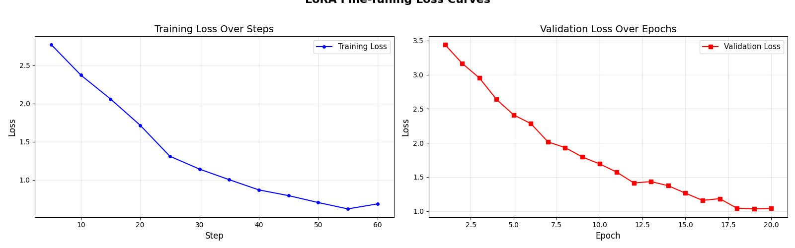

# LLM Fine-Tuning: Custom Teaching Assistant

## 📌 Overview
This project demonstrates the end-to-end process of fine-tuning a Large Language Model (LLM) to adopt a specific, highly structured persona. The goal was to transform a base language model into a "Computer Science Teaching Assistant" that explains complex concepts using a strict **real-life analogy + step-by-step breakdown** format.

## 🧠 Model & Methodology
- **Base Model:** `distilgpt2` (82M parameters, Transformer Decoder)
- **Fine-Tuning Technique:** Low-Rank Adaptation (LoRA) via Hugging Face `peft`
- **Training Strategy:** Parameter-Efficient Fine-Tuning (PEFT) was used to freeze the base model weights and only train a tiny fraction of adapter weights (~0.98% of total parameters). This prevents catastrophic forgetting and allows the model to be trained efficiently on consumer hardware.
- **LoRA Configuration:** `r=16`, `alpha=32`, targeting the `c_attn` and `c_proj` layers.

## 📚 Dataset Curation
A custom, manually curated dataset of 25 high-quality instruction-response pairs was created. 
- **Style:** Every response strictly follows a three-part structure: An intuitive analogy, a 4-step technical breakdown, and a one-sentence key takeaway.
- **Label Masking:** During training, the instruction tokens and padding tokens were masked (`-100`) so the model purely learned how to *respond*, rather than memorizing the prompts.

## 📊 Results & Performance

### Training Progression
The model was fine-tuned over 20 epochs. The loss curves below demonstrate the successful convergence of the LoRA adapters, showing steady improvement in both training and validation loss without severe overfitting.

### Generation Quality Comparison
To evaluate the success of the fine-tuning, the same prompt was fed to both the Base Model and the Fine-Tuned Model.

**Prompt:** *"Explain dynamic programming"*

**❌ Base Model Output (Before Training):**
> *Explain dynamic programming. It's a very powerful and flexible language for writing complex code that can be written in any environment, without having to do anything special or complicated things with it (like the compiler). The main difference is you're going to have two different types of languages...*
*(Result: Rambling, factually incorrect, and completely misses the point of the question).*

**✅ Fine-Tuned Model Output (After LoRA):**
> *Imagine you are climbing a staircase and someone asks you how many ways you can reach step 10. Instead of recalculating from step 1 every time, you write down the answer for step 1, step 2, step 3, and so on, on sticky notes. When you need the answer for step 10, you just look at your notes for steps 8 and 9.*
> *Step 1: Identify that the problem has overlapping subproblems.*
> *Step 2: Solve each subproblem once and store the result.*
> *Step 3: When a subproblem is needed again, look it up instead of recomputing.*
> *Step 4: Build up the final answer from these stored results.*
> *Key takeaway: Dynamic programming trades memory for speed by remembering past results.*
*(Result: Perfectly structured, perfectly accurate, and successfully mimics the target teaching style).*

## 💻 How to Run
1. Ensure you have the required dependencies (`transformers`, `peft`, `accelerate`, `datasets`) installed from the main repository.
2. Run the `Fine_Tuning_LLM.py` script to initiate the LoRA fine-tuning process.

---
*This project is part of my professional AI Engineering portfolio.*
