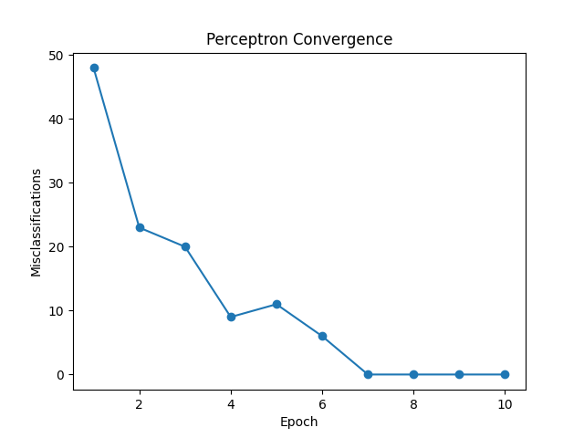
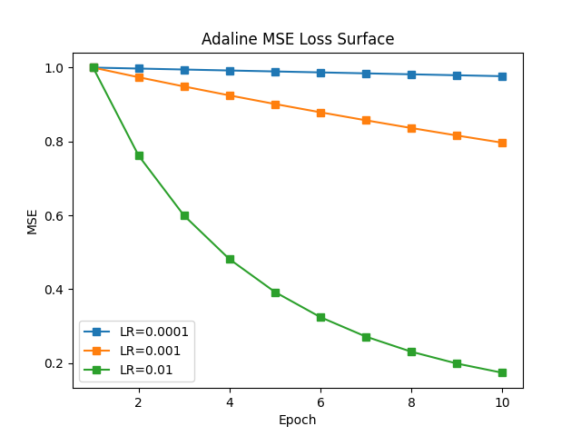
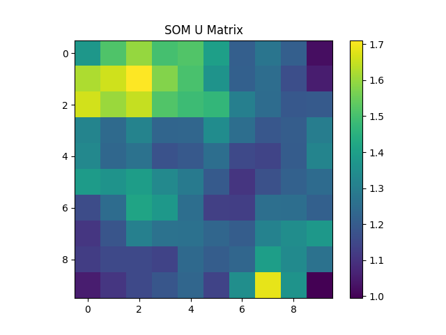
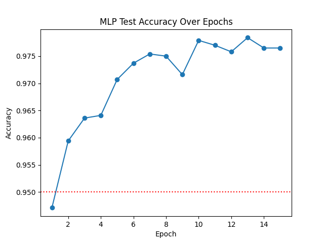

# Neural Networks From Scratch

## 📌 Overview
This project demonstrates a deep, fundamental understanding of machine learning by implementing several classical neural network architectures entirely from scratch. No high-level deep learning frameworks (like TensorFlow or PyTorch) were used to build the models, compute gradients, or handle backpropagation. 

Everything is built using pure **NumPy** and linear algebra.

## 🏗️ Implemented Architectures

### 1. The Perceptron
The earliest neural network algorithm, implemented for binary classification. The model updates its single set of weights based on misclassification errors over the MNIST dataset.
- **Learning Algorithm:** Rosenblatt's Perceptron Rule
- **Dataset:** MNIST (Binary subset)

### 2. Adaline (Adaptive Linear Neuron)
An improvement over the Perceptron that uses continuous predicted values to calculate a loss function and updates weights using Gradient Descent.
- **Learning Algorithm:** Batch Gradient Descent
- **Loss Function:** Mean Squared Error (MSE)
- **Feature:** Demonstrates convergence at different learning rates.

### 3. Self-Organizing Map (SOM)
An unsupervised neural network used to produce a low-dimensional, discretized representation of the input space.
- **Learning Algorithm:** Competitive Learning
- **Output:** A U-Matrix (Unified Distance Matrix) that visualizes the topological structure of the MNIST digit clusters.

### 4. Multi-Layer Perceptron (MLP)
A fully connected, feed-forward artificial neural network. This implementation includes forward propagation, loss calculation, and a complete backpropagation algorithm derived and coded by hand.
- **Architecture:** 784 (Input) → 128 (Hidden) → 64 (Hidden) → 10 (Output)
- **Activations:** ReLU (Hidden layers), Softmax (Output layer)
- **Loss Function:** Cross-Entropy Loss
- **Optimizer:** Mini-Batch Stochastic Gradient Descent (SGD)

## 📊 Results & Visualizations

Below are the performance charts generated by the models during their respective training processes:

| Perceptron Convergence | Adaline MSE Loss Surface |
| :---: | :---: |
|  |  |

| Self-Organizing Map U-Matrix | MLP Test Accuracy Over Epochs |
| :---: | :---: |
|  |  |

## 💻 How to Run
1. Ensure you have `numpy` and `matplotlib` installed.
2. The `download_mnist.py` script requires `torchvision` strictly for downloading the dataset (no PyTorch is used for modeling).
3. Run `Neural_Networks_From_Scratch.py` to train all four networks sequentially and export the performance charts.

---
*This project is part of my professional AI Engineering portfolio.*
