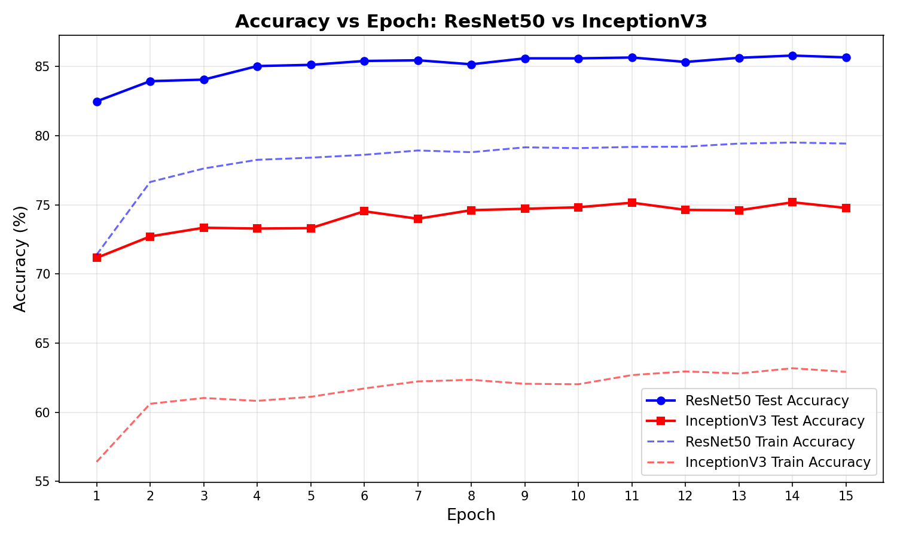
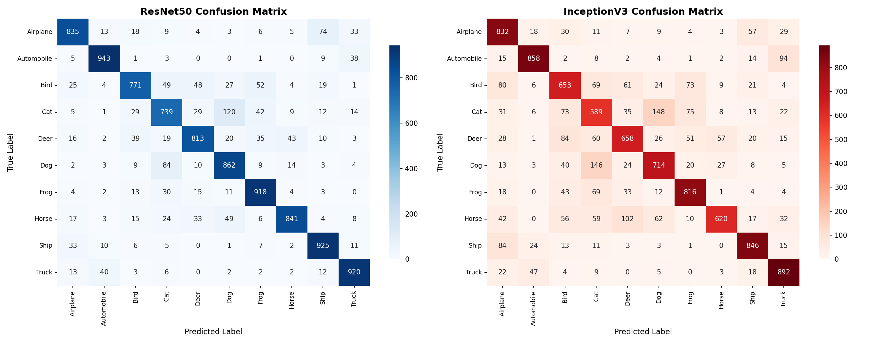
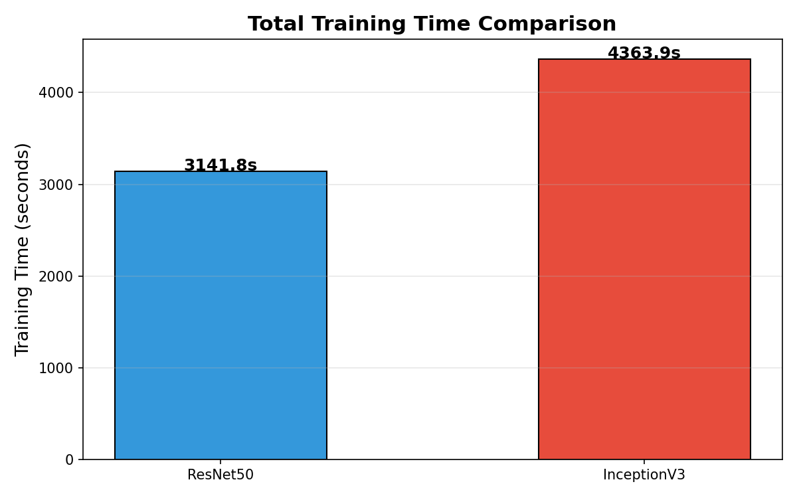
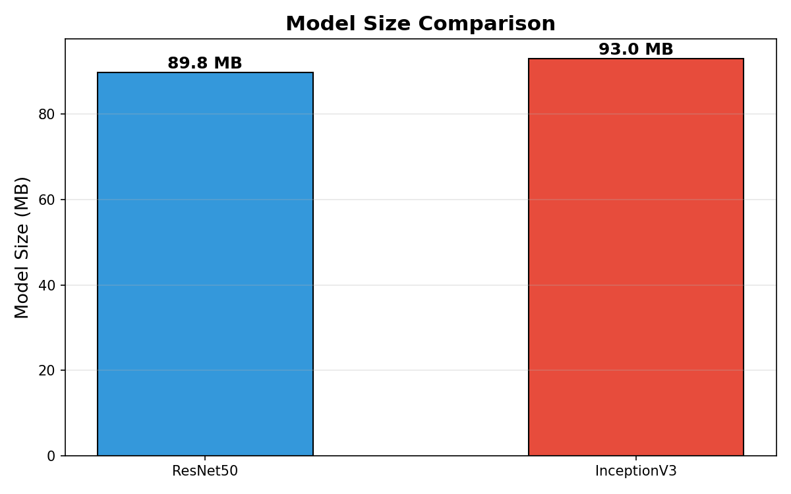

# Image Classification using Transfer Learning

## 📌 Overview
This project demonstrates advanced **Computer Vision** techniques using **Transfer Learning** in PyTorch. The objective is to classify images from the CIFAR-10 dataset into their respective 10 categories. 

Instead of training a model from scratch, this project leverages two state-of-the-art pretrained Convolutional Neural Network (CNN) architectures—**ResNet50** and **InceptionV3**—to compare their performance, training time, and resource efficiency.

## 🏗️ Model Architectures
Both models were loaded with pretrained ImageNet weights, and their final fully connected layers were replaced and fine-tuned for the 10-class CIFAR-10 dataset.

1. **ResNet50:** Utilizes residual blocks with skip connections to solve the vanishing gradient problem, allowing for extremely deep networks.
2. **InceptionV3:** Utilizes factorized convolutions and auxiliary classifiers to extract multi-scale features efficiently.

## 📊 Results & Performance Comparison

The models were evaluated based on accuracy, loss, and predictive consistency. Below are the visual comparisons generated during the training phase:

### Accuracy & Confusion Matrices
| Accuracy Comparison | Confusion Matrices |
| :---: | :---: |
|  |  |

### Computational Efficiency
| Training Time | Model Size |
| :---: | :---: |
|  |  |

## 🌐 Interactive Web App (Streamlit)
To make this project accessible and interactive, it includes a fully functional web application built with **Streamlit**. The app automatically loads the highest-performing model and allows users to upload custom images for real-time classification.

### How to Run the App
1. Ensure you have the dependencies installed:
   ```bash
   pip install -r requirements.txt
   ```
2. Launch the Streamlit application:
   ```bash
   streamlit run app.py
   ```
3. Open the provided local URL in your browser, upload an image, and watch the model predict its class!

---
*This project is part of my professional AI Engineering portfolio.*
